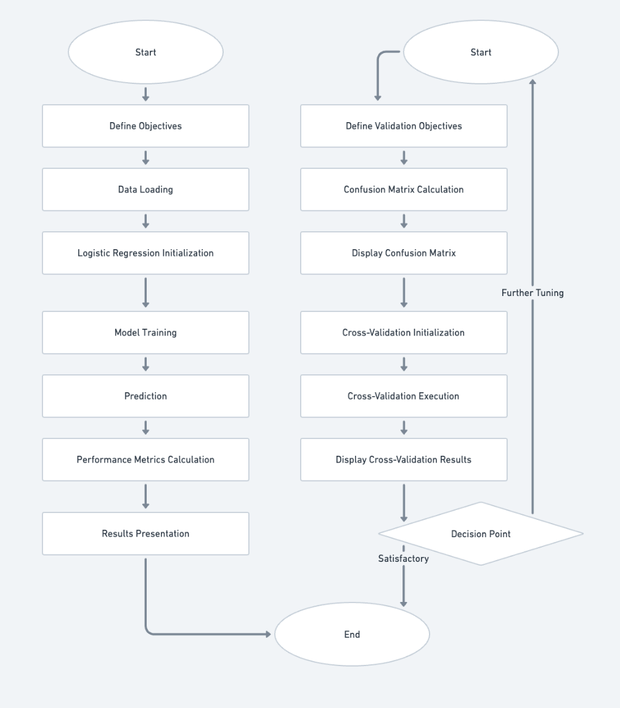

# Project 2: ML Classification (Breast Cancer)

## Overview
Built and evaluated multiple classification models on a breast cancer dataset. The project compares Logistic Regression and Random Forest, and includes cross-validation and hyperparameter optimization to improve performance.

## What’s included
- **Notebook:** end-to-end training + evaluation (`notebook/dmml_classification.ipynb`)
- **Dataset:** CSV used in the experiments (`data/data.csv`)
- **Diagrams:** workflow visuals for the ML pipeline (`assets/`)

## Repository structure
- `assets/` — pipeline/workflow diagrams (PNG)
- `data/` — dataset (CSV)
- `notebook/` — Jupyter notebook with code and results

## Diagrams
### Logistic Regression pipeline

### Random Forest pipeline

### Hyperparameter optimization workflow

### Cross-validation workflow

## How to run
1. Open `notebook/dmml_classification.ipynb`
2. Dataset source
The dataset is sourced from Kaggle and loaded directly via its public URL.
For convenience and reproducibility, a local copy is also included in the repository under `data/data.csv`.
3. Run all cells to reproduce preprocessing, training, and evaluation results
